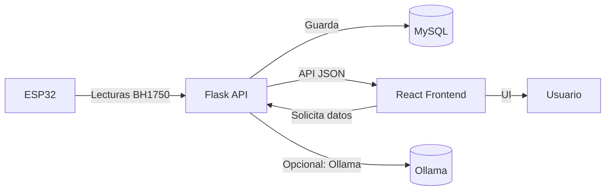

# Proyecto_Cognitive

Este repositorio contiene el frontend y backend del sistema inteligente de iluminación.

## Dockerización

Se agregaron los archivos necesarios para ejecutar la aplicación con Docker:

# Sistema Inteligente de Iluminación Académica

Este repositorio contiene el backend (Flask), frontend (React + Vite) y la infraestructura Docker para el proyecto "Sistema Inteligente de Iluminación Académica".

## Contenido

- `backend/` — API REST en Flask, servicios, modelos y controladores.
- `frontend/` — SPA en React + TypeScript (Vite), componentes y páginas.
- `docker-compose.yml` — orquesta servicios: `db`, `backend`, `frontend`.

## Arquitectura

El flujo principal de datos es:



## Tecnologías

- Backend: Flask, SQLAlchemy, Flask-RESTX
- Frontend: React, TypeScript, Vite, React Router, Axios, Tailwind
- Infra: Docker, docker-compose, MySQL
- Chatbot: Ollama (modelo `mistral`)

## Quickstart (Docker)

Requisitos: Docker, Docker Compose.

Desde la raíz del proyecto:

```bash
docker compose up --build
```

Servicios:
- Frontend: `http://localhost:4173` (dev) o Nginx en producción
- Backend: `http://localhost:5000`

## Variables importantes

- Backend: configura `backend/.env` (DB host, user, password, secret JWT, etc.)
- Frontend: `frontend/.env` define `VITE_API_BASE_URL` (por defecto `http://localhost:5000`)

## Endpoints principales

- `GET /api/dashboard/salones` — Obtener información de salones (estado, nivel_alerta, lux)
- `GET /api/salones/:id` — Detalle del salón
- `GET /api/salones/:id/sensores` — Lecturas / historial (historial completo)
- `GET /api/reportes/cumplimiento-iluminacion/:id` — Porcentaje de cumplimiento histórico
- `POST /api/chat` — LumiBot (proxy a Ollama con filtro)

## Roles

- `administrador` — permisos de creación/edición de salones y actividades
- `alumno` — permiso de solo lectura

## Flujo de autenticación

- Autenticación por JWT; el frontend almacena token en `localStorage` y usa interceptor de Axios para enviar `Authorization: Bearer <token>`.

## Configuración ESP32 y BH1750

- El ESP32 lee BH1750 y envía `lux`, `intensidad_led`, `consumo_energetico`, `modo_automatico` al endpoint del Flask encargado de sensores.
- Clasificación del ESP32 (y ahora consistente en backend):

```
if lux <= 100:
	estado = "Ambiente oscuro"
elif lux <= 6000:
	estado = "Ambiente con iluminación media"
else:
	estado = "Ambiente muy iluminado"
```

Intensidad LED en modo automático:
- Ambiente oscuro → `intensidadLED = 160`
- Ambiente con iluminación media → `intensidadLED = 80`
- Ambiente muy iluminado → `intensidadLED = 0`

## Documentación y archivos Markdown

Este `README.md` centraliza la documentación. Se han consolidado contenidos y eliminado archivos duplicados para evitar inconsistencias.

Mantén este archivo como la referencia principal.

## LumiBot

LumiBot es el asistente integrado que responde preguntas **solo** relacionadas con el proyecto y está expuesto en `POST /api/chat`.
Las respuestas de LumiBot se entregan en texto plano sin formato Markdown, eliminando `**`, `*` y `#`.
Si la información disponible no es suficiente para responder con certeza, LumiBot debe indicarlo explícitamente y no inventar datos.

## Desarrollo local (frontend)

- Dev server Vite: `npm run dev` (puerto `4173`)
- `VITE_API_BASE_URL` puede apuntar a `http://localhost:5000` o al backend en Docker (`host.docker.internal` si corres desde contenedor)

## Configuración de red local y Firewall Windows

- Si ejecutas Ollama en Windows y Flask en Docker, usa `host.docker.internal:11434` para alcanzar el servicio desde el contenedor.
- Asegura el puerto 11434 en el Firewall si es necesario.

## Mejores prácticas y mejoras futuras

- Añadir tests E2E para el flujo ESP32 → DB → UI
- Monitorización y alertas en Prometheus/Grafana
- Control fino del PWM por escenarios

---
Para detalles avanzados, ejemplo de variables y comandos específicos, revisa las secciones dentro de este README.

## Decisiones de Diseño: Eliminación de `Configuración`

Resumen
-------
Se eliminó la interfaz y el endpoint CRUD de `Configuración` de la primera versión pública porque
los valores almacenados no son aplicados por los dispositivos ESP32 y generan confusión en los
usuarios. Editar valores en el backend no afecta a los ESP32 en campo.

Decisión
--------
- Quitar la página `Configuración` del frontend y el endpoint `/api/configuracion` del backend.
- Reemplazar las lecturas dinámicas de la tabla `configuracion` por valores por defecto en tiempo
	de ejecución que coinciden con la configuración del firmware ESP32.

Valores por defecto utilizados
-----------------------------
- `umbral_lux`: 100
- `intensidad_led_default`: 80
- `pwm_alto` (intensidad máxima): 160
- `max_consumo`: 100.0
- `modo_automatico`: true

Razonamiento
-----------
- El firmware del ESP32 no consulta ni aplica configuraciones almacenadas en la API.
- Mantener una configuración centralizada en la UI daba una falsa sensación de control.
- Usar constantes mantiene la coherencia entre backend y firmware y reduce la superficie de
	mantenimiento. Si en el futuro el firmware soporta recibir configuración remota, la funcionalidad
	puede restaurarse.

Notas
-----
- Los archivos de migración y los SQL dumps que contienen la tabla `configuracion` se conservaron
	como respaldo histórico.
